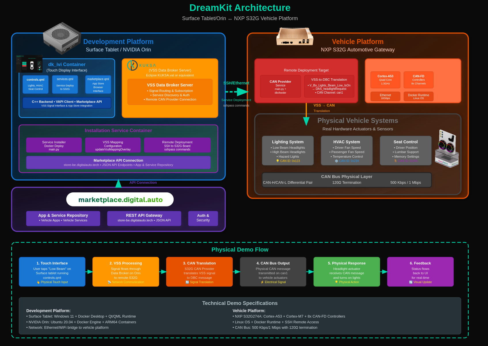
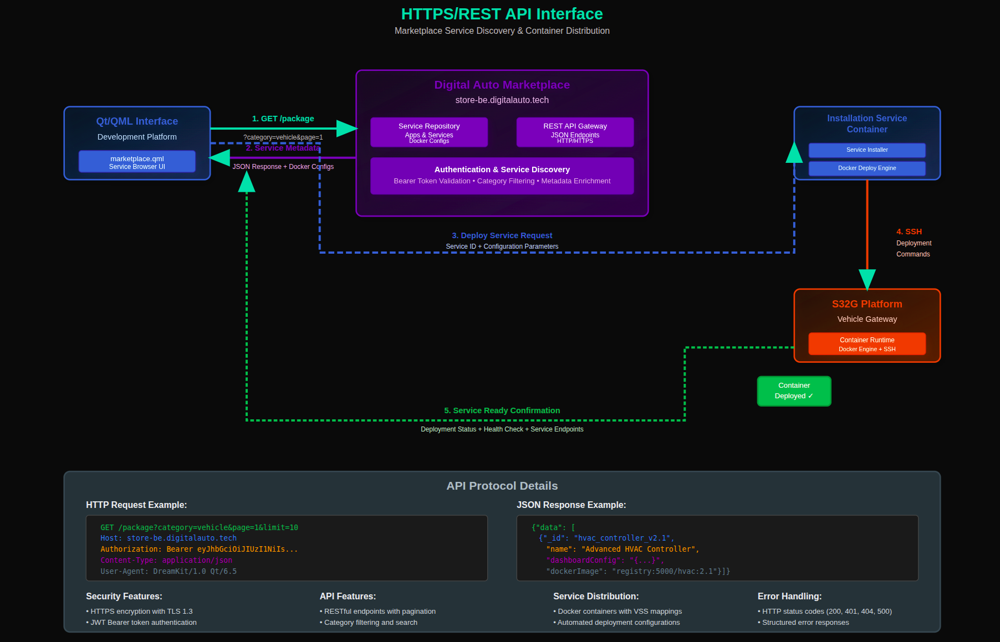
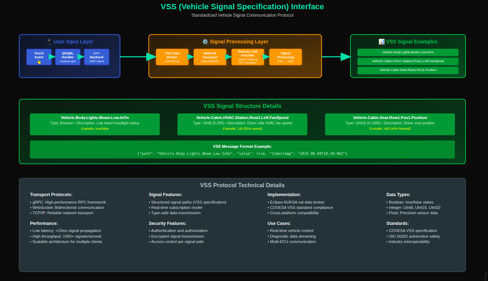
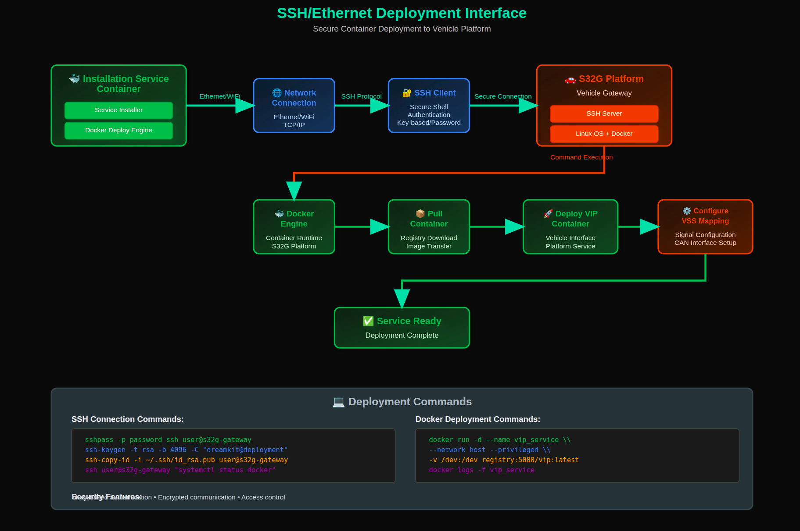
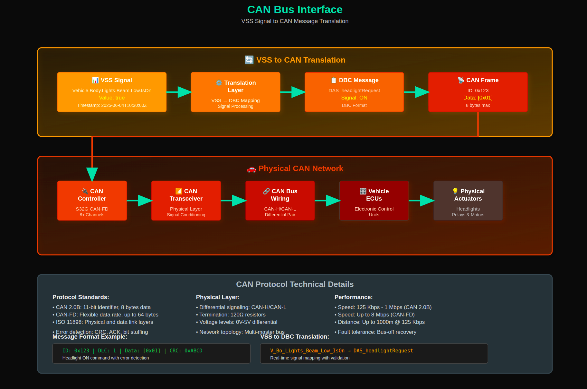
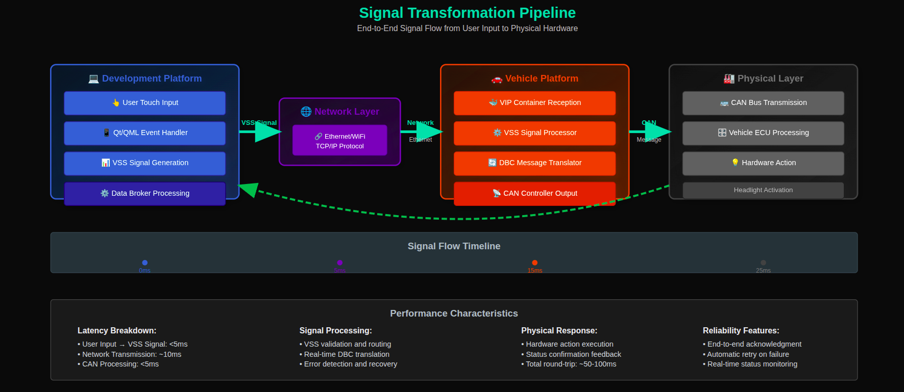
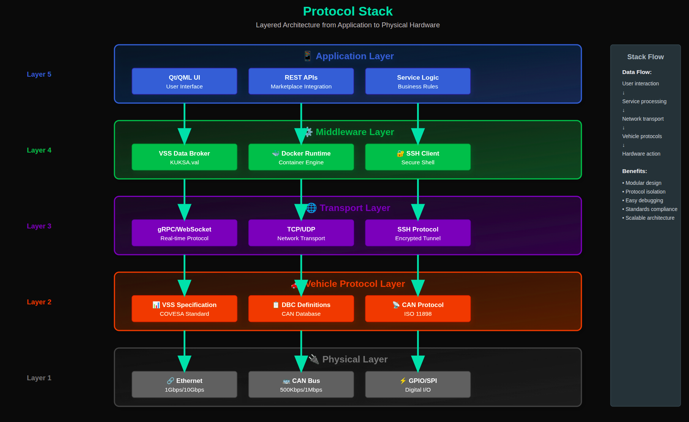
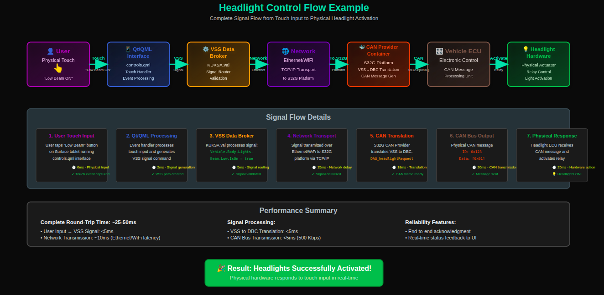

# DreamKit: Software-Defined Vehicle Development Platform

## Overview

DreamKit is a containerized platform that connects development environments to real vehicle hardware through standardized automotive protocols. It enables rapid development and testing of vehicle applications with immediate physical feedback.

## System Architecture

*Figure 1: DreamKit system architecture showing the relationship between Development Platform (Surface Tablet/NVIDIA Orin), Digital Auto Marketplace (cloud services), Vehicle Platform (NXP S32G), and Physical Vehicle Systems with signal flow demonstration.*

**Architecture Overview:**
DreamKit follows a distributed architecture pattern with four main layers: the development platform running Qt/QML interfaces, a cloud-based marketplace for service distribution, the vehicle platform (S32G gateway) for real-time processing, and physical vehicle systems. This separation enables development teams to work with familiar tools while seamlessly connecting to automotive hardware through standardized protocols.

## Communication Interfaces

### 1. HTTPS/REST API Interface

*Figure 2: Service discovery and container distribution workflow through the Digital Auto Marketplace*

**Protocol Details:**
- **Transport**: HTTPS over TCP/IP
- **Authentication**: Bearer token
- **Data Format**: JSON metadata
- **Endpoints**: `/package`, `/login`

**Interface Purpose:**
This interface handles the discovery and distribution of vehicle applications and services. Developers can browse, download, and deploy containerized vehicle services directly from the marketplace to their development environment or target vehicle platform. The secure HTTPS connection ensures safe transmission of Docker configurations and service metadata.

### 2. VSS (Vehicle Signal Specification) Interface

*Figure 3: Standardized vehicle signal communication using VSS specification*

**Protocol Details:**
- **Transport**: gRPC/WebSocket over TCP
- **Data Format**: Structured signal paths
- **Subscription**: Real-time signal updates
- **Standard**: VSS (Vehicle Signal Specification)

**Interface Purpose:**
VSS provides a standardized way to communicate with vehicle systems using hierarchical signal paths like `Vehicle.Body.Lights.Beam.Low.IsOn`. This abstraction layer allows developers to work with semantic vehicle data without needing to understand the underlying CAN bus complexities. The Eclipse KUKSA.val data broker handles signal routing, validation, and real-time subscriptions.

### 3. SSH/Ethernet Deployment Interface

*Figure 4: Secure container deployment to vehicle platforms via SSH*

**Protocol Details:**
- **Transport**: SSH over Ethernet/WiFi
- **Security**: Key-based or password authentication
- **Commands**: Docker container management
- **Configuration**: VSS signal mappings

**Interface Purpose:**
This interface enables remote deployment of containerized services to vehicle platforms like the S32G gateway. Using SSH ensures secure communication while Docker provides consistent runtime environments. The deployment process includes automatic configuration of VSS signal mappings and CAN interface setup, making it easy to push development code to real vehicle hardware.

### 4. CAN Bus Interface

*Figure 5: VSS signal translation to CAN bus messages for vehicle hardware control*

**Protocol Details:**
- **Standard**: CAN 2.0B / CAN-FD
- **Speed**: 500 Kbps / 1 Mbps
- **Format**: DBC (Database CAN) definitions
- **Physical**: Differential pair (CAN-H/CAN-L)

**Interface Purpose:**
The CAN bus interface translates high-level VSS signals into low-level CAN messages that vehicle ECUs understand. DBC (Database CAN) files define the mapping between semantic signals and binary CAN frames. This translation happens automatically on the S32G platform, allowing developers to work with user-friendly signal names while maintaining compatibility with automotive hardware standards.

## Signal Transformation Pipeline

*Figure 6: End-to-end signal flow from user input to physical hardware action*

**Pipeline Overview:**
The signal transformation pipeline demonstrates how user interactions flow through the entire system to produce physical results. Starting with touch input on a Qt/QML interface, signals are processed through the VSS data broker, transmitted over the network to the vehicle platform, translated to CAN messages, and finally execute hardware actions. The complete round-trip typically takes 50-100ms, providing near real-time feedback for development and testing.

## Protocol Stack

*Figure 7: Layered protocol architecture from application to physical hardware*

**Stack Benefits:**
The layered protocol stack follows OSI model principles, providing clear separation of concerns. Application developers work with Qt/QML and REST APIs, while the middleware handles VSS data brokering and containerization. Transport layers manage network communication and security, vehicle protocols handle automotive standards compliance, and the physical layer interfaces with actual hardware. This modular approach enables independent development and testing of each layer.

## Example: Headlight Control Flow

*Figure 8: Complete workflow demonstrating headlight control from touch input to physical activation*

**Real-World Example:**
This concrete example shows how touching a "Low Beam ON" button on a Surface tablet results in actual headlights turning on. The 25ms end-to-end latency demonstrates the platform's real-time capabilities. Each step is tracked and validated, providing developers with immediate feedback about their code's impact on physical vehicle systems. This rapid prototyping capability accelerates automotive software development cycles.

## Key Technologies

- **Frontend**: Qt/QML with C++ backend for cross-platform UI development
- **Protocols**: VSS for semantic vehicle data, CAN/DBC for hardware communication, REST APIs for service integration, SSH for secure deployment
- **Containerization**: Docker with automated deployment pipelines for consistent runtime environments
- **Standards**: Eclipse KUKSA.val data broker, COVESA VSS specification for industry compliance
- **Hardware**: Surface tablets and NVIDIA Orin for development, NXP S32G automotive gateway for vehicle integration

## Platform Benefits

This architecture enables rapid automotive application development with real-time hardware validation through standardized protocols and containerized microservices. Developers can:

- **Rapid Prototyping**: Test vehicle applications immediately on real hardware
- **Standards Compliance**: Use industry-standard VSS and CAN protocols
- **Scalable Development**: Containerized services work across different vehicle platforms
- **Cloud Integration**: Access marketplace services and remote deployment capabilities
- **Real-Time Feedback**: See immediate results of code changes on physical vehicle systems

DreamKit bridges the gap between traditional automotive development and modern software engineering practices, enabling faster innovation in the automotive industry.